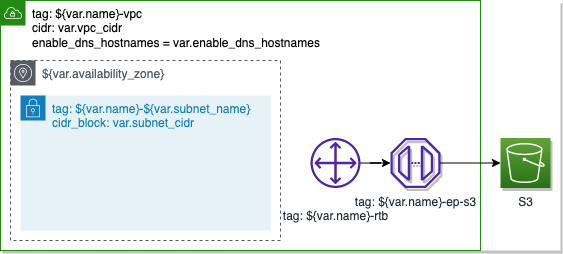

# Terraform Modules for AWS VPC

## Private Subnet



### Variables

| Varriable Name     | Default                         | Description |
| ------------------ | ------------------------------- | ----------- |
| vpc_id             |                                 |             |
| name               |                                 |             |
| subnet_cidr        |                                 |             |
| availability_zone  | ap-northeast-1a                 |             |
| subnet_name        | private-1a                      |             |
| create_s3_endpoint | true                            |             |
| s3_service_name    | com.amazonaws.ap-northeast-1.s3 |             |

### Usage

```terraform
module "vpc" {
    source = "github.com/tamuto/terramod/aws/vpc/vpc"

    name = "name"
    vpc_cidr = "10.0.0.0/16"
}

module "network" {
    source = "github.com/tamuto/terramod/aws/vpc/private"

    vpc_id = module.vpc.vpc_id

    name = "name"
    subnet_cidr = "10.0.0.0/24"
}
```
