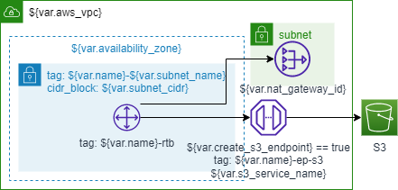

# Terraform Modules for AWS VPC

## Private Subnet



### Variables

| Varriable Name       | Default                         | Description |
| -------------------- | ------------------------------- | ----------- |
| name                 |                                 |             |
| enable_dns_hostnames | true                            |             |
| vpc_cidr             |                                 |             |
| subnet_cidr          |                                 |             |
| availability_zone    | ap-northeast-1a                 |             |
| subnet_name          | private-a1                      |             |
| create_s3_endpoint   | true                            |             |
| s3_service_name      | com.amazonaws.ap-northeast-1.s3 |             |

### Usage

```terraform
module "network" {
    source = "github.com/tamuto/terramod/aws/vpc/private"

    name = "name"

    vpc_cidr = "10.0.0.0/16"
    subnet_cidr = "10.0.0.0/24"
}
```
