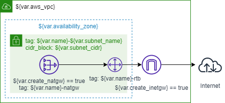

# Terraform Modules for AWS VPC

## Public Subnet



### Variables

| Varriable Name       | Default         | Description |
| -------------------- | --------------- | ----------- |
| name                 |                 |             |
| enable_dns_hostnames | true            |             |
| vpc_cidr             |                 |             |
| subnet_cidr          |                 |             |
| availability_zone    | ap-northeast-1a |             |
| subnet_name          | public-1a       |             |
| create_inetgw        | false           |             |
| create_natgw         | false           |             |

### Outputs

| Variable Name | Description |
| ------------- | ----------- |
|               |             |

### Usage

```terraform
module "network" {
    source = "github.com/tamuto/terramod/aws/vpc/public"

    name = "name"

    vpc_cidr = "10.0.0.0/16"
    subnet_cidr = "10.0.0.0/24"

    create_inetgw = true
    create_natgw = true
}
```
